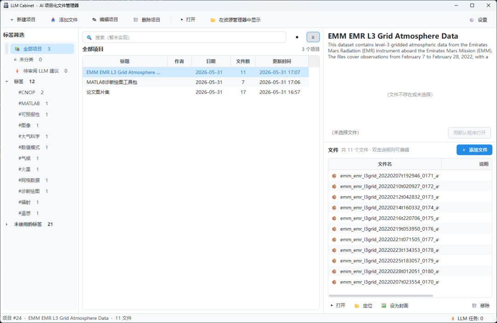
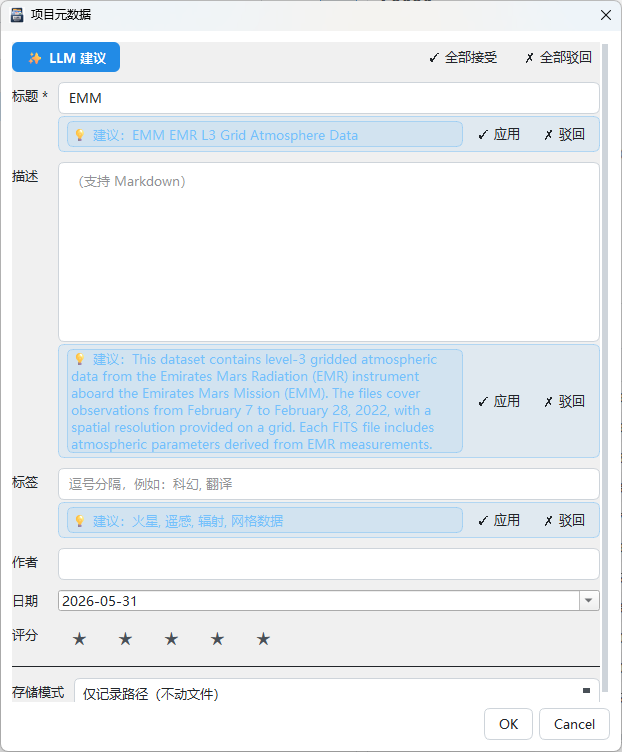

<div align="center">


# LLM Cabinet

A lightweight, project-centric file manager with an AI metadata assistant (Windows desktop).  
Organize files by "project" with custom fields, tags, Markdown descriptions, covers, and multi-provider LLM suggestions.

English · [简体中文](README.zh-CN.md)

</div>

## Notice

> **Heads-up — UI is Chinese-only for now.** The application's interface, prompts, and in-app dialogs are written in Simplified Chinese. Due to limited maintainer bandwidth, an English UI is not planned at the moment. This README and [PRIVACY.md](PRIVACY.md) are available in English so you can decide whether the app fits your use case. If you can read Chinese, the app is fully usable; otherwise expect to rely on machine translation for the in-app text.

**This is a personal hobby project; stability is not guaranteed. The author only provides ideas — almost all code is AI-generated. No quality guarantees.**

**Disclaimer**: The maintainer will continue to support this software, but **assumes no responsibility for any file loss, data corruption, or other damages arising from its use** — including but not limited to abnormal usage, misoperation, system failures, or third-party LLM service issues. Please **keep regular backups** of important data. The software is provided "AS IS", see [MIT License](LICENSE).

## Inspiration

This project is inspired by classic library-style file managers like [Calibre](https://calibre-ebook.com/) — organizing files by "library" with tags and rich metadata is wonderfully efficient, but **the human cost of maintaining metadata is brutal**: typing in titles, authors, tags, and descriptions one file at a time scares most people away.

The recently emerging "LLM-Wiki" idea (see Andrej Karpathy's [LLM Wiki gist](https://gist.github.com/karpathy/442a6bf555914893e9891c11519de94f) and related projects such as [nashsu/llm_wiki](https://github.com/nashsu/llm_wiki)) demonstrates a workflow where **an LLM reads raw source material and autonomously produces & maintains structured entries**. Borrowing that workflow into file management gives us a simple idea: **let a tireless LLM act as the librarian — read the files and maintain the metadata itself**.

LLM Cabinet brings that idea to the personal-file-library scenario: keep the Calibre-style project / tag / field abstractions, and hand the most tedious "read-file → fill-metadata" step to an LLM.

## Screenshots

<table>
  <tr>
    <td align="center" width="62%">
      
      <br/><sub>Main window — tag tree · project list · preview &amp; file table</sub>
    </td>
    <td align="center" width="38%">
      
      <br/><sub>Project edit dialog with inline LLM suggestions (✓ Apply / ✗ Reject)</sub>
    </td>
  </tr>
</table>

## Features

- **Project-centric organization**: one project groups related files; each file can carry its own per-file note (e.g. "Chinese edition", "page 1")
- **Field system**: built-in *Title / Author / Date / Rating / Source / Tags / Description* plus user-defined fields. Free reorder, hide, and per-field type (text / textarea / date / URL / rating / number)
- **Tags** are a first-class multi-value field; filter by tag in the sidebar; unused tags fold into a separate group
- **Two storage modes** (per project)
  - `link`: only record the original path; never touch user files
  - `copy`: import a copy into the unified library directory `library/<project_id>/`
- **Preview**: inline image / video / PDF preview; other types open with the system default app
- **Drag & drop**: drop files/folders onto blank area to create a new project, onto a project card to attach to it; folder drops default to the folder name as the title
- **LLM metadata assistant** (the headline feature)
  - Built-in adapters for DeepSeek / OpenAI / Google Gemini / xAI Grok
  - One-click field suggestions based on current metadata + your selected reference files (PDF / docx / xlsx / code / images …)
  - Background serial queue with progress; suggestions go into a *pending review* flow — ✓ Apply / ✗ Reject per field, or accept/reject all
  - Per-field switch: disable LLM suggestion for a single field while still passing its current value to the model as context
- **Project export**: one-click export from toolbar / right-click menu into a local
  directory containing `project.json` / `files.json` / `README.md` / `files/`. Choose
  whether to also copy the original files of link-mode (🔗) entries. The bundle is
  transparent and inspectable — usable as backup, cross-device migration, or as the
  standard carrier for a future import feature
- **Database**: SQLite — portable, zero-config

## Run

```powershell
python -m venv .venv
.venv\Scripts\activate
pip install -r requirements.txt
python -m app.main
```

> Requires Python 3.10+. On first launch the app creates `cabinet.db` and `library/` under `%APPDATA%/LLMCabinet/`. Inspect/change locations under **Settings → Library**.

## Data Privacy

LLM Cabinet is a local-first app — all project data lives on your machine. Network calls happen **only when you explicitly trigger "LLM metadata suggestion"** to the LLM provider you yourself configured. For the full data-flow breakdown, the controls you have, and known caveats, see [PRIVACY.md](PRIVACY.md) ([简体中文](PRIVACY.zh-CN.md)).

## Configure LLM

Open **Settings → API**:
1. Fill in the `API Key` for the provider(s) you want to use (other fields auto-fill defaults)
2. Click **🔌 Test Connection** (only does a lightweight `GET /models`, doesn't consume inference quota)
3. Pick your **default provider** and **default language**

Then trigger suggestions from:
- The **✨ LLM Suggest** button in the project edit dialog, or
- Right-click a project in the list → **LLM Metadata Suggestion…**

## Package as a single .exe

```powershell
pip install pyinstaller
pyinstaller -w -F -n "LLM Cabinet" `
  --icon icon.ico `
  --add-data "icon.ico;." `
  --add-data "icon.jpg;." `
  --add-data "PRIVACY.md;." `
  --add-data "PRIVACY.zh-CN.md;." `
  --add-data "app/ui/assets;app/ui/assets" `
  run.py
```

> The repo ships an `icon.ico` (multi-resolution: 16/32/48/64/128/256, 32-bit RGBA). If you replace it, keep the multi-size layout so the app icon stays crisp across all Windows views.

The resulting `dist/LLM Cabinet.exe` is portable.

## Project Layout

```
app/
├── main.py            entry point
├── db.py              SQLite connection, schema & migrations
├── models.py          dataclasses
├── repository.py      data access layer
├── library.py         library directory & file landing strategy
├── exporter.py        project export (directory format + project.json)
├── utils.py
├── llm/
│   ├── config.py      LLM config (providers + defaults)
│   ├── providers.py   DeepSeek / OpenAI / Gemini / Grok adapters
│   ├── prompts.py     prompt templates
│   ├── context.py     prompt assembly + text extraction (pdf/xlsx/docx/code/…)
│   └── queue.py       background task queue
└── ui/
    ├── main_window.py        3-pane main UI (tag tree / project list / preview + files)
    ├── project_dialog.py     project metadata editor + suggestion review
    ├── llm_suggest_dialog.py LLM trigger dialog (pick reference files & target fields)
    ├── llm_tasks_panel.py    task queue panel
    ├── export_dialog.py      project export dialog
    ├── settings_dialog.py    settings (general / library / view / fields / API / about)
    ├── tag_tree.py
    ├── preview.py            inline image / video / PDF preview
    ├── project_card.py       grid view model + card painting
    └── widgets.py
```

## FAQ

### Taskbar icon looks wrong on first launch

The first time you launch a new build of the exe, the Windows taskbar may briefly show a default / generic icon instead of the app icon. **Just close the program and reopen it once** — the icon will be correct from then on. This is a well-known interaction between the Windows icon cache and PyInstaller onefile builds; functionality is not affected.

## License

[MIT](LICENSE) © 2026 vortexer99
