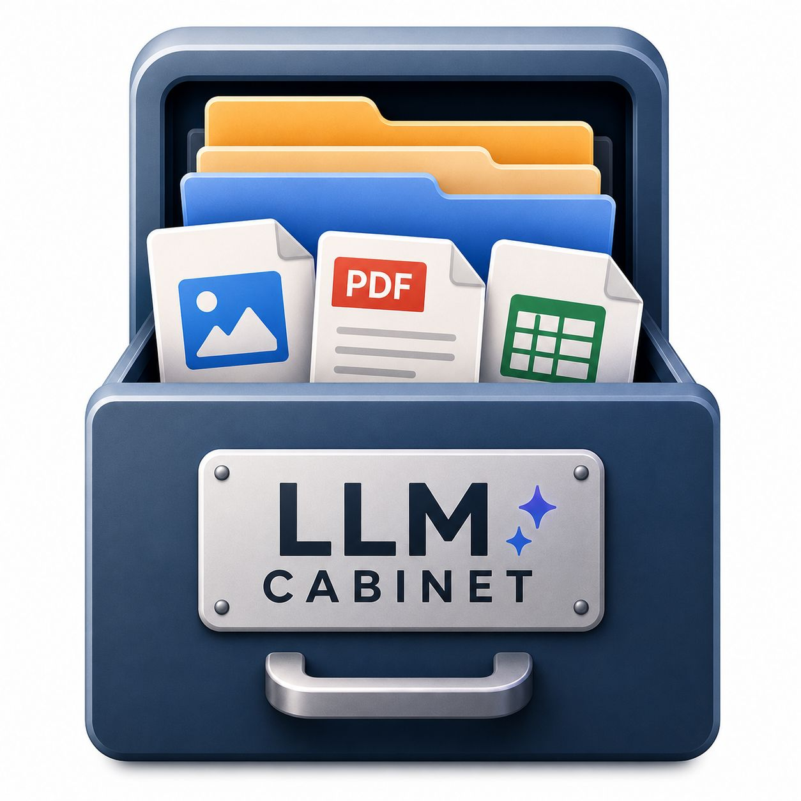
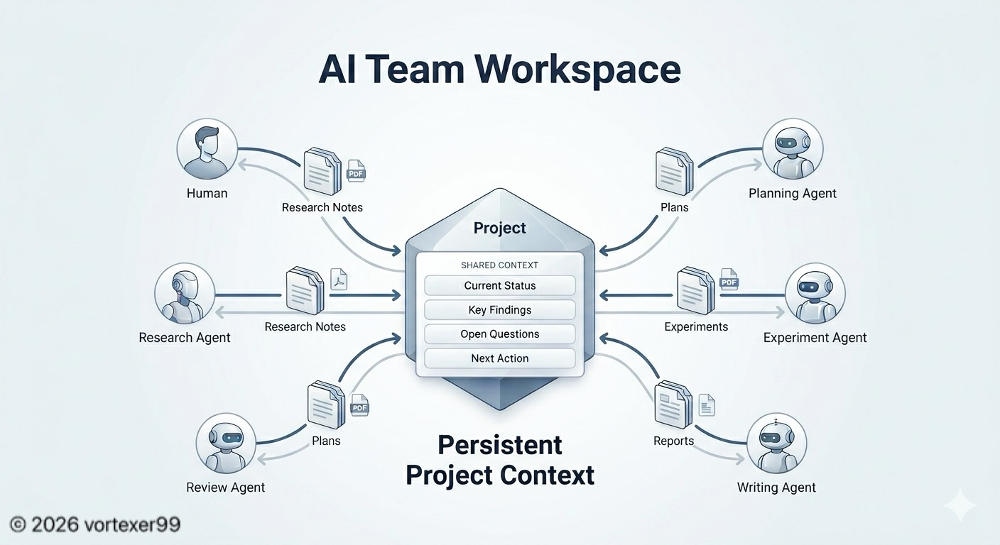
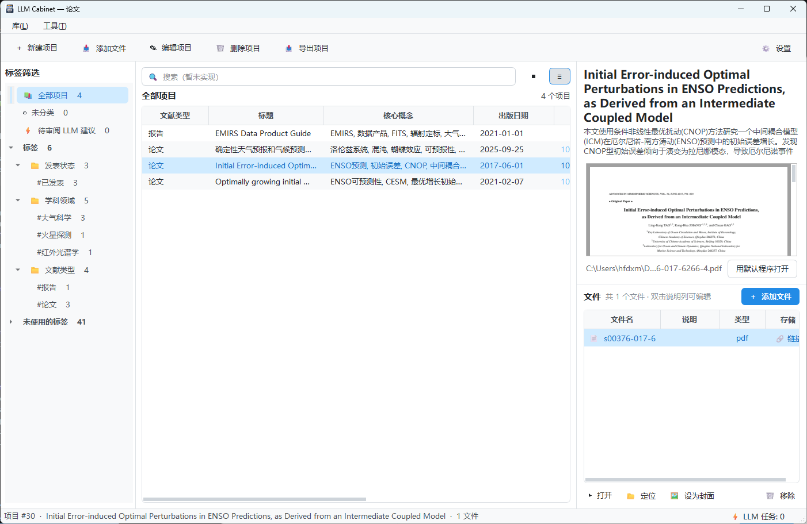
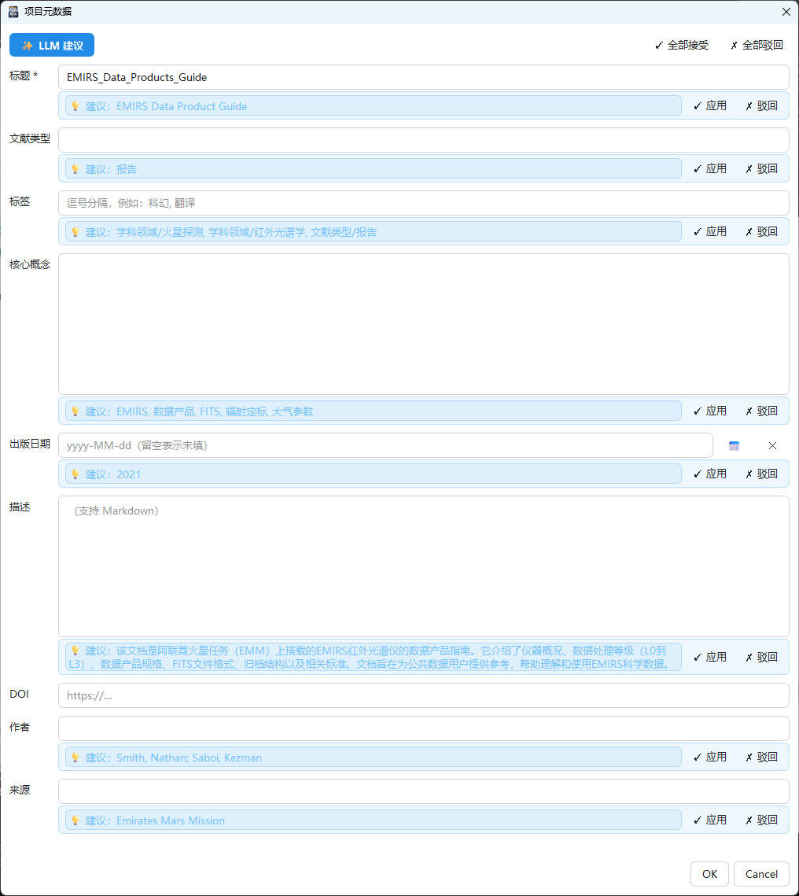
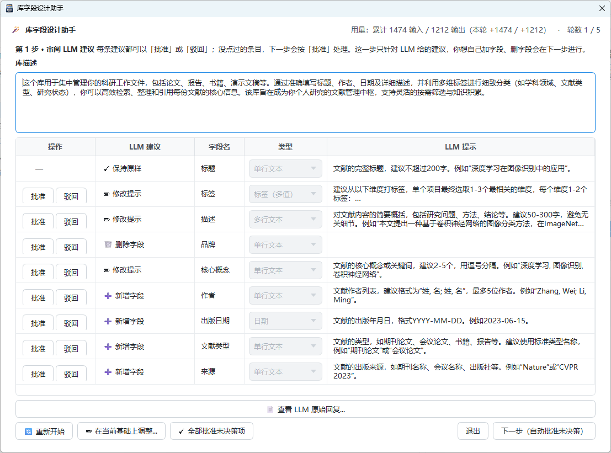
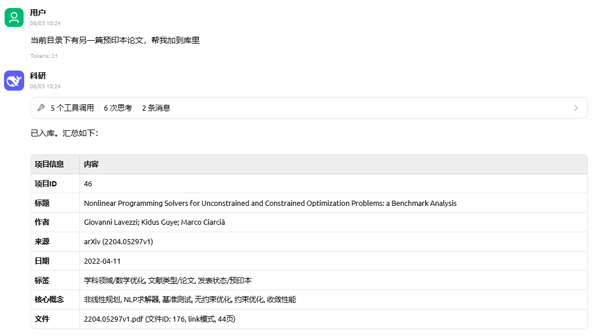
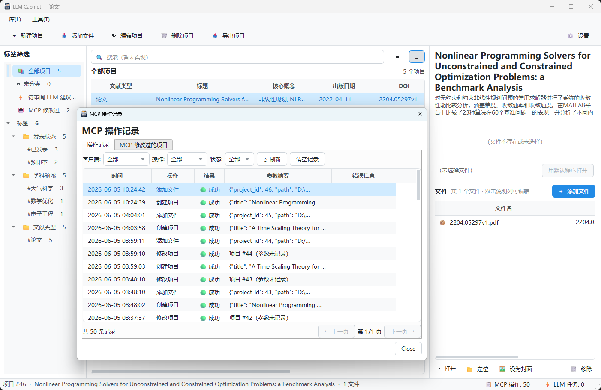

<div align="center">



# LLM Cabinet

A lightweight, project-centric file manager with an AI metadata assistant (Windows desktop).  
Organize files by "project" with custom fields, tags, Markdown descriptions, covers, and multi-provider LLM suggestions.

English · [简体中文](README.zh-CN.md)

</div>

## Notice

> **Heads-up — UI is Chinese-only for now.** The application's interface, prompts, and in-app dialogs are written in Simplified Chinese. Due to limited maintainer bandwidth, an English UI is not planned at the moment. This README and [PRIVACY.md](PRIVACY.md) are available in English so you can decide whether the app fits your use case. If you can read Chinese, the app is fully usable; otherwise expect to rely on machine translation for the in-app text.

**This is a personal hobby project; stability is not guaranteed. The author only provides ideas — almost all code is AI-generated. No quality guarantees.**

**Pre-1.0 notice**: versions before 1.0.0 are for early adopters and testing. We do not recommend putting them into heavy daily use — expect breaking changes, rough edges, and occasional data quirks.

**Disclaimer**: The maintainer will continue to support this software, but **assumes no responsibility for any file loss, data corruption, or other damages arising from its use** — including but not limited to abnormal usage, misoperation, system failures, or third-party LLM service issues. Please **keep regular backups** of important data. The software is provided "AS IS", see [MIT License](LICENSE).

## Inspiration

This project is inspired by classic library-style file managers like [Calibre](https://calibre-ebook.com/) — organizing files by "library" with tags and rich metadata is wonderfully efficient, but **the human cost of maintaining metadata is brutal**: typing in titles, authors, tags, and descriptions one file at a time scares most people away. Assigning the right tags takes effort, and so does going back to update existing entries when you add a new field. Even if you skip metadata entirely and just use plain folder hierarchies, **the management cost doesn't go away** — every "what should I name this file?" and "which subfolder does it belong in?" still chips away at your attention.

The recently emerging "LLM-Wiki" idea (see Andrej Karpathy's [LLM Wiki gist](https://gist.github.com/karpathy/442a6bf555914893e9891c11519de94f) and related projects such as [nashsu/llm_wiki](https://github.com/nashsu/llm_wiki)) demonstrates a workflow where **an LLM reads raw source material and autonomously produces & maintains structured entries**. Borrowing that workflow into file management gives us a simple idea: **let a tireless LLM act as the librarian** — first designing a metadata scheme that fits your library (which fields, what format), then doing the per-project reading and upkeep against that scheme.

Compared to LLM-Wiki, **you don't always need the LLM to digest every file** — that burns a lot of tokens, and what you actually want is often just "keep things tidy and findable". LLM Cabinet brings that pragmatic version of the idea to the personal-file-library scenario: keep the Calibre-style project / tag / field abstractions, and hand the most tedious "read-file → fill-metadata" step to an LLM **on demand**, with explicit per-file opt-in.

**Looking ahead**:

- **File preprocessing pipeline**: to further reduce token consumption — and to make non-multimodal models actually useful — there may be a pluggable preprocessing layer that distills raw files into compact "key-information summaries" before sending them to the LLM. Typical forms: extract a few keyframes from videos and treat them as images, run a lightweight local vision model on images to pre-extract tags/captions, run embeddings on very long texts for semantic compression or key-section extraction, and so on.

## Looking Further: AI Team Workspace

As more people connect Cabinet to multiple AI agents (Claude Code, Cursor, custom MCP clients), Cabinet naturally evolves into something bigger than a personal file manager — a **shared memory hub** where Human + multiple Agents collaborate around the same project, reading and writing the same files and metadata even when they cannot talk to each other directly.

<div align="center">
  
  <br/>
  <sub>A project becomes the <b>shared context</b> (current status · key findings · open questions · next action) — every team member, human or agent, reads from and writes to it. Files are the carrier; metadata is the memory.</sub>
</div>

This is a **direction**, not a finished story — Cabinet today is already a usable file manager; the workspace narrative is the path we are gradually building toward (e.g. MCP integration, audit log, provenance tracking are early steps).

## Screenshots

<table>
  <tr>
    <td align="center" colspan="2">
      
      <br/><sub>Main window — tag tree · project list · preview &amp; file table</sub>
    </td>
  </tr>
  <tr>
    <td align="center" width="50%">
      
      <br/><sub>Project edit dialog with inline LLM suggestions (✓ Apply / ✗ Reject)</sub>
    </td>
    <td align="center" width="50%">
      
      <br/><sub>Library field design wizard — Step 1 review LLM suggestions ↔ Step 2 hand-edit the resulting field table</sub>
    </td>
  </tr>
  <tr>
    <td align="center" width="50%">
      
      <br/><sub>MCP integration — agent creates a project with full metadata in one shot</sub>
    </td>
    <td align="center" width="50%">
      
      <br/><sub>MCP audit log &amp; imported project in Cabinet</sub>
    </td>
  </tr>
</table>

## Features

- **Project-centric organization**: one project groups related files; each file can carry its own per-file note (e.g. "Chinese edition", "page 1")
- **Field system**: 3 protected fields *Title / Tags / Description* are seeded for every library; 4 optional preset fields *Author / Date / Rating / Source* can be checked on at library-creation time; on top of that you can freely add user-defined fields. Reorder, hide, and pick per-field type (text / textarea / date / URL / rating / number) at any time.
- **Library field design wizard**: an LLM-powered wizard (Tools → 🪄 LLM Assistants → Library Field Design Assistant) takes your one-paragraph library description, suggests the right field set, and applies the diff after a two-step review (Step 1 approve/reject LLM suggestions → Step 2 hand-edit the resulting field table).
- **Search and tags**: use the top search box for Calibre-like queries such as `tag:科幻 AND author:刘慈欣 AND rating:>=4`, including title/description keywords, field filters, tags, `AND` / `OR` / `NOT`, and parentheses. Successful searches are saved to recent history, and useful expressions can be starred for reuse. Sidebar tag filters or tag-folder filters combine with the query as `AND` by default, with an optional whole-library search toggle; selected projects can be dragged onto sidebar tags for bulk assignment. Tags are a first-class multi-value field.
- **Two storage modes** (per project)
  - `link`: only record the original path; never touch user files
  - `copy`: import a copy into the unified library directory `library/<project_id>/`
- **Preview**: inline image / video / PDF preview; other types open with the system default app
- **Drag & drop**: drop files/folders onto blank area to create a new project, onto a project card to attach to it; folder drops default to the folder name as the title. **Dropping multiple folders** lets you choose between "merge into one project" and "one project per folder"; the latter recognizes each folder's `project.json` and restores its metadata. Subdirectory structure is preserved as a virtual tree in the UI.
- **File tree view**: files are organized in a collapsible tree by logical subfolder (`files.subfolder` in DB), decoupled from physical storage. Directories appear as 📁 nodes; tree view supports per-project column sorting, internal drag-and-drop reordering/moving, persistent empty folders, F2/Shift+F2 rename flows, and folder-level storage actions such as convert-to-library-copy, move, and reassociate missing files. Empty folders dropped in create 0-file projects; deep/large imports trigger a confirmation dialog.
- **LLM metadata assistant** (the headline feature)
  - Built-in adapters for DeepSeek / OpenAI / Google Gemini / xAI Grok
  - One-click field suggestions based on current metadata + your selected reference files (PDF / docx / xlsx / code / images …)
  - Background serial queue with progress; suggestions go into a *pending review* flow — ✓ Apply / ✗ Reject per field, or accept/reject all
  - Per-field switch: disable LLM suggestion for a single field while still passing its current value to the model as context
- **Project export / batch import**: one-click export from toolbar / right-click menu into a
  local directory containing `project.json` / `files.json` / `README.md` / `files/`. Choose
  whether to also copy the original files of link-mode (🔗) entries. The reverse: drop
  multiple project folders onto the bottom DropZone and choose "one project per folder" —
  each `project.json` is recognized and its metadata / fields / tags restored, closing the
  export/import loop.
- **MCP Agent integration**: expose your library via [MCP](https://modelcontextprotocol.io/) so
  any compatible client (Claude Desktop / Cursor / Cline / Cherry Studio) can drive an agent
  that searches, creates, and manages projects with metadata — complete with four pre-built
  Agent skills (organize / audit / summarize / suggest-tags), audit logging, and MCP-modified
  project tracking. Configure from **Settings → MCP**.
- **Database**: SQLite — portable, zero-config

## Run

```powershell
python -m venv .venv
.venv\Scripts\activate
pip install -r requirements.txt
python -m app.main
```

> Requires Python 3.10+. On first launch the app shows a Welcome dialog: pick a directory to create a brand-new library (a multi-step wizard collects the library description, default storage mode, optional preset fields, etc.) or open an existing one. The chosen library directory holds `cabinet.db` + `library/` + a `.llm-cabinet` marker; inspect the current paths under **Settings → Library**, and use **Library → Switch Library** to relocate or jump between libraries.

## Data Privacy

LLM Cabinet is a local-first app — all project data lives on your machine. Network calls happen **only when you explicitly trigger "LLM metadata suggestion"** to the LLM provider you yourself configured. For the full data-flow breakdown, the controls you have, and known caveats, see [PRIVACY.md](PRIVACY.md) ([简体中文](PRIVACY.zh-CN.md)).

## Configure LLM

Open **Settings → API**:
1. Fill in the `API Key` for the provider(s) you want to use (other fields auto-fill defaults)
2. Click **🔌 Test Connection** (only does a lightweight `GET /models`, doesn't consume inference quota)
3. Pick your **default provider** and **default language**

Then trigger suggestions from:
- The **✨ LLM Suggest** button in the project edit dialog, or
- Right-click a project in the list → **LLM Metadata Suggestion…**

## Package as a single .exe

```powershell
pip install pyinstaller
pyinstaller -w -F -n "LLM Cabinet" `
  --icon icon.ico `
  --add-data "icon.ico;." `
  --add-data "icon.jpg;." `
  --add-data "PRIVACY.md;." `
  --add-data "PRIVACY.zh-CN.md;." `
  --add-data "app/ui/assets;app/ui/assets" `
  run.py
```

> The repo ships an `icon.ico` (multi-resolution: 16/32/48/64/128/256, 32-bit RGBA). If you replace it, keep the multi-size layout so the app icon stays crisp across all Windows views.

The resulting `dist/LLM Cabinet.exe` is portable.

## Project Layout

```
app/
├── main.py            entry point
├── db.py              SQLite connection, schema & migrations
├── models.py          dataclasses
├── repository.py      data access layer
├── library.py         library directory & file landing strategy
├── library_check.py   library consistency check / backup / restore
├── cabinet.py         multi-library registry (recent / switch / delete)
├── exporter.py        project export (directory format + project.json)
├── importer.py        batch folder import (recognizes project.json)
├── utils.py
├── mcp/
│   ├── server.py              MCP server (17 → 5 aggregate tools)
│   ├── standalone.py          standalone entry point
│   ├── tools.py               tool implementations
│   ├── prompts.py             Agent skill templates
│   ├── resources.py           data resources
│   ├── context.py             library context & switching
│   └── skills/                Agent skills (organize / audit / summarize / suggest-tags)
├── llm/
│   ├── config.py      LLM config (providers + defaults)
│   ├── providers.py   DeepSeek / OpenAI / Gemini / Grok adapters
│   ├── prompts.py     prompt templates
│   ├── context.py     prompt assembly + text extraction (pdf/xlsx/docx/code/…)
│   └── queue.py       background task queue
└── ui/
    ├── main_window.py        3-pane main UI (tag tree / project list / preview + files)
    ├── welcome_dialog.py     first-launch / "no library open" entry
    ├── project_dialog.py     project metadata editor + suggestion review
    ├── llm_suggest_dialog.py LLM trigger dialog (pick reference files & target fields)
    ├── llm_tasks_panel.py    task queue panel
    ├── mcp_audit_dialog.py   MCP audit log viewer
    ├── export_dialog.py      project export dialog
    ├── import_dialog.py      batch folder import dialog
    ├── folder_drop_mode_dialog.py  "merge / separate" picker for multi-folder drops
    ├── settings_dialog.py    settings (general / library / view / fields / API / MCP / about)
    ├── about_dialog.py
    ├── tag_tree.py
    ├── preview.py            inline image / video / PDF preview
    ├── project_card.py       grid view model + card painting
    ├── files_table_columns.py
    ├── first_run_banner.py
    ├── theme.py              light / dark palette + QSS
    ├── wizard_list_dialog.py LLM-assistant wizard launcher
    ├── wizards/              LLM assistants (library field design wizard, …)
    └── widgets.py
```

> Developer end-to-end self-check scripts live in [`selftests/`](./selftests/README.md) (run manually, not in CI).

For manual feature testing, generate a complete sample library with:

```powershell
python tools/create_sample_library.py --target sample-library --force
```

Then open `sample-library/` from **Library → Switch Library**. See [`docs/sample-library.md`](./docs/sample-library.md) for the covered scenarios.

## Moving & Syncing Your Library

Each LLM Cabinet library is **one self-contained directory** (containing `cabinet.db` + `library/` + a `.llm-cabinet` marker). **No export/import needed to relocate**:

1. Close LLM Cabinet
2. In your file manager, **cut & paste** the entire library directory to the new location (other drive, network drive, USB stick)
3. Reopen LLM Cabinet, choose **Library → Switch Library** and pick the new location

Cross-device syncing (OneDrive / Dropbox / etc.) works the same way. **Caveat**: only one client may have the library open at a time (SQLite single-writer lock). Keep the app closed while the sync agent finishes uploading to avoid write conflicts.

For point-in-time snapshots, use **Tools → 📦 Backup this library** to zip the whole directory; restore with **Tools → 📥 Restore library from backup** by picking the zip + an empty target directory.

## FAQ

### Taskbar icon looks wrong on first launch

The first time you launch a new build of the exe, the Windows taskbar may briefly show a default / generic icon instead of the app icon. **Just close the program and reopen it once** — the icon will be correct from then on. This is a well-known interaction between the Windows icon cache and PyInstaller onefile builds; functionality is not affected.

## License

[MIT](LICENSE) © 2026 vortexer99
